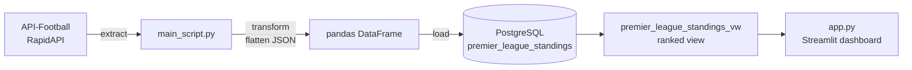

# Premier League Standings Pipeline: API → PostgreSQL → Streamlit

A Python ETL pipeline that pulls Premier League standings from a REST API, flattens the nested JSON into a table, loads it into PostgreSQL, builds a ranked SQL view, and serves the result in an interactive Streamlit dashboard.


## Tech stack

Python · Requests · pandas · SQLAlchemy · PostgreSQL · Streamlit · Plotly

## How it works



**`main_script.py`** runs the pipeline in three steps:

1. **Extract:** calls the API-Football `/standings` endpoint for the 2020/21 Premier League season, with a request timeout and handling for HTTP, timeout and connection errors.
2. **Transform:** flattens each team's nested JSON (rank, team, games played, wins, draws, losses, goals for and against, goal difference, points) into one row of a pandas DataFrame.
3. **Load:** writes the DataFrame to PostgreSQL with explicit column types, then rebuilds a view that ranks teams using the Premier League's tie-breakers: points, then goal difference, then goals scored.

**`app.py`** reads the view and shows the league table, with an optional bar chart of points by team.

## Design decisions

- **Credentials stay out of the code.** API keys and database details are read from environment variables (`.env`), and `.env` is excluded by `.gitignore`. `.env.example` shows which values are needed.
- **The load is one transaction.** Dropping the view, replacing the table and recreating the view either all succeed or all roll back, so the database is never left half-updated.
- **Failures stop the run clearly.** API errors, empty responses and database errors are logged to the console and to `standings.log`, and the script exits with a non-zero status, so a scheduler like cron or Airflow can tell the run failed.
- **The ranking lives in SQL.** The view, not the app, owns the ranking logic, so any tool reading the database gets the same table.
- **The dashboard caches its query** for 10 minutes, so the database isn't hit on every click.

## Repository structure

```
├── main_script.py      # extract, transform and load pipeline
├── app.py              # Streamlit dashboard
├── requirements.txt
├── .env.example        # environment variables to set
└── .gitignore
```

## How to run

1. Get a free API key for [API-Football on RapidAPI](https://rapidapi.com/api-sports/api/api-football) and have a PostgreSQL database available (local or hosted).
2. Install the dependencies:
   ```bash
   pip install -r requirements.txt
   ```
3. Copy `.env.example` to `.env` and fill in your API key and database details.
4. Run the pipeline:
   ```bash
   python main_script.py
   ```
5. Start the dashboard:
   ```bash
   streamlit run app.py
   ```

## Limitations and next steps

- **One season, full refresh.** The season and league are fixed in the script, and each run replaces the table. Next step: pass the season as a parameter and keep history across seasons with a season column.
- **Runs manually.** Scheduling with cron or Airflow would keep the data current during a live season.
- **No automated tests.** Next step: unit tests for `transform()` using a saved sample API response, and checks such as "20 teams" and "no null points" after loading.
